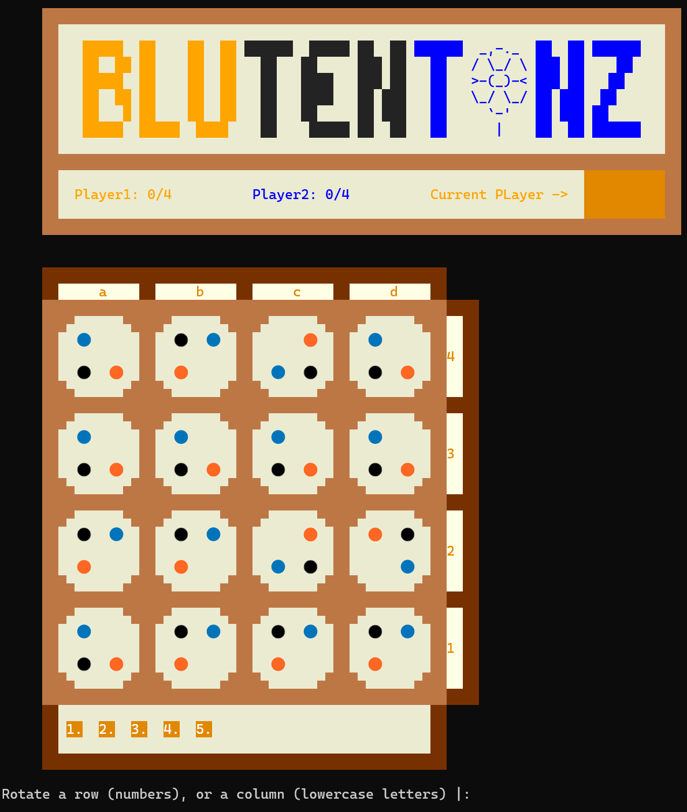

# Blütentanz
#### Group Blütentanz_7

| Members | Up | Participations |
|---------|----|----------------|
|Dinis Afonso Cerqueira Galvão | up202207217| 50% |
|Joana Luís Sá Marques Pimenta | up202206120 | 50% |

#### Participations
In this project the tasks were well divided since both members had the opportunity to work togetther in all the tasks. To ease the distribution of the work we decided to make one of the members the responsible of every task, even if we work on them together.

Dinis was more responsible for Board.pl, display and visuals, turn and rotation in game and the Bot modes in the game, this include functions like display_game(+GameState), value(+GameState, +Player, -Value) and choose_move(+GameState, +Level, -Move).

Joana was more responsible for Move.pl, Menu.pl, Game Over and Settings of game configurations, this include functions like initial_state(+GameConfig, -GameState), move(+Gamestate, +Move,-NewGameState), valid_moves(+GameState,-ListOfMoves) and game_over(+GameState, -Winner).

#### Execution
After having installed the SICStus Prolog 4.9 and entered this project, to execute you just need reach the `/src` directory and run `sicstus` then `[game].`  to compile the code and `play.` to run it.

#### Description of the game
In this game, you play in a board composed by rows and columns of tiles (4 by 4 in the original game). These Tiles have 4 diffent position, one for each quarter with 3 different colors (grey,blue,orange) and one empty. At the start of each of your turns you have to rotate all of the Tiles in a row or column 90 degrees clockwise, and then you can start moving your pieces. In a turn you can move up to 3 different times but only rotate once, and this rotation must be at the start of the turn. To move, you can only go to 1 space up, down, left or right in the board if the color of the space is the same as your piece or grey. To win you must reach a certain number of pieces (4 out of 5 in the original version) to the opposite side of the board until they leave the board. The first player to reach their 4 pieces out of the board on the opposing side wins.



#### Links for Rules
1 - https://boardgamegeek.com/boardgame/428363/blutentanz

#### Considerations for game extensions
We changed the original game so players can decide settings like board size, number of pieces and pieces necessary to win. If the player does not choose any setting the game will just play with the original settings. The limitations in chosing your setting is that in board size width and height must be lower then 9, so the board doesn't get to big, the maximum number of pieces per player should be less or equal to the double of the Width of the Board, and the pieces to win cannot be greater then the number of pieces per player. These limitations aim to keep the game playable in any scenario, if any invalid input is inserted in the settings then the default settings can also be automatically chosen. In addition we also have the option to set the board to have the width different from the height, which is different from the original game.

#### Game Logic
Game Configuration
  
In the Menu.pl we have a `default_config(config([5, 5], [4, 4], [human, human], [4, 4])). ` that defines the default configuration which can be changed in the settings menu. The function main_menu outputs the final configuration (default or not) to the Game.pl.
Here that configuration will be initialized by initial_state/2 before the game starts. Our initial_state will recieve a configuration like `config([Player1PiecesCount,Player2PiecesCount],[Rows, Columns], [Player1Type, Player2Type],PiecesToWin)` that defines the Number of Pieces per player, the Board Size , PlayerType e PiecesToWin. Player type isn't decided in the settings , instead there is a menu where the player can decide which type of game to play and that will change the player type. Playertypes can be `human` , `dumbbot` and `smartbot`. The output of initial_state is the GameState. 

GameState

A GameState is `state(Board, Players, CurrentPlayer, PiecesToWin)`. In a GameState the Board is represented by a matrix of Tiles, in initial_state the Tiles are randomize and the matrix follows the desired size. A tile is represented by `tile([empty,orange,blue,gray],rotation)` where the rotation can be 0, 90, 180 or 270 degrees. Here is an example of a Board:
```
[[tile([empty,orange,blue,gray],0),tile([empty,orange,blue,gray],270),tile([empty,orange,blue,gray],90),tile([empty,orange,blue,gray],270)],
[tile([empty,orange,blue,gray],0),tile([empty,orange,blue,gray],0),tile([empty,orange,blue,gray],0),tile([empty,orange,blue,gray],0)],
[tile([empty,orange,blue,gray],0),tile([empty,orange,blue,gray],0),tile([empty,orange,blue,gray],180),tile([empty,orange,blue,gray],0)],
[tile([empty,orange,blue,gray],180),tile([empty,orange,blue,gray],0),tile([empty,orange,blue,gray],90),tile([empty,orange,blue,gray],270)]]
```
In a GameState, Players are represented by a list `[player( player1 , PlayerType, color, PlayerPieces),player( player2 , PlayerType, color, PlayerPieces)]`. Players have there player number, there type (`human` , `dumbbot` and `smartbot`), the color, for player1 is always orange and for player 2 blue and their pieces. PlayerPieces are represented by a list of the players pieces. A piece is `piece(Position,Id)`. 

In a GameState, CurrentPlayer is just the player( playerNum , PlayerType, color, PlayerPieces) of the player who is currently playing it's turn. At initialization current player is always orange (player1) and so orange always starts first.

Finally, in GameState we also have PiecesToWin, which is simply a list of the number of pieces necessary to win, for example `[5,5]` means player 1 needs to score 5 as well as player 2.

Move Representation

In Move.pl we can check all function related to movements in game. Here we have a function `display_possible_moves(Round,GameState,NewGameState, NewRound) ` that is called in Game.pl and that makes sure to receive the input needed , Round and GameState, and returns NewGameState and NewRound. This function will call all the other functions that make sure we are able to move pieces around, functions like valid_move/2 and move/3. In `move(+GameState, +Move, -NewGameState)` Move is a `(Idx, Piece)` where Idx is the Index in which the Piece is inserted in the list of the Player Pieces, this value (Idx) is the same as the Piece Id since the Pieces are ordered. Piece is of type `piece(Position,Id)` where position is `[[BoardX,BoardY],[TileX,TileY]] ` ,for example, the lower left space in the lower left tile of the board is [[1,1],[1,1]]`.

User Interaction
  


